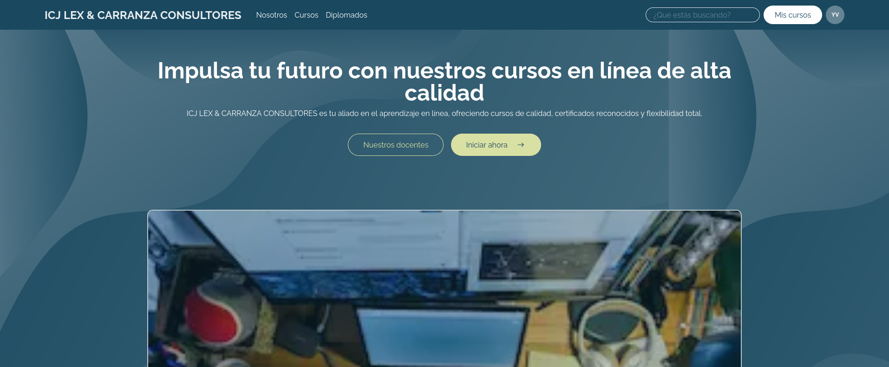

# React + TypeScript + Vite

This template provides a minimal setup to get React working in Vite with HMR and some ESLint rules.

Currently, two official plugins are available:

- [@vitejs/plugin-react](https://github.com/vitejs/vite-plugin-react/blob/main/packages/plugin-react/README.md) uses [Babel](https://babeljs.io/) for Fast Refresh
- [@vitejs/plugin-react-swc](https://github.com/vitejs/vite-plugin-react-swc) uses [SWC](https://swc.rs/) for Fast Refresh

## Expanding the ESLint configuration

If you are developing a production application, we recommend updating the configuration to enable type aware lint rules:

- Configure the top-level `parserOptions` property like this:

```js
export default tseslint.config({
  languageOptions: {
    // other options...
    parserOptions: {
      project: ['./tsconfig.node.json', './tsconfig.app.json'],
      tsconfigRootDir: import.meta.dirname,
    },
  },
})
```

- Replace `tseslint.configs.recommended` to `tseslint.configs.recommendedTypeChecked` or `tseslint.configs.strictTypeChecked`
- Optionally add `...tseslint.configs.stylisticTypeChecked`
- Install [eslint-plugin-react](https://github.com/jsx-eslint/eslint-plugin-react) and update the config:

```js
// eslint.config.js
import react from 'eslint-plugin-react'

export default tseslint.config({
  // Set the react version
  settings: { react: { version: '18.3' } },
  plugins: {
    // Add the react plugin
    react,
  },
  rules: {
    // other rules...
    // Enable its recommended rules
    ...react.configs.recommended.rules,
    ...react.configs['jsx-runtime'].rules,
  },
})
```

<h2 align="center">ICJLEX & CARRANZA CONSULTORES</h2>

<h4 align="center">
:construction: Project in development :construction:
</h4>

<p align="center">
  
  
  
</p>

**ICJ LEX & CARRANZA CONSULTORES** is a web application designed to provide quality courses to the general public, the application will have two (02) portals or sections, so that clients can view their courses and so that the administrator can manage the courses and more. The application is built with modern technologies to ensure security and scalability.




## Installation and Setup

To run the project locally, follow these steps:

1. Clone the repository

```bash
https://github.com/ngcraftz/icj-lex-academy-front
cd icj-lex-academy-front
```

2. Install dependencies

```bash
npm install
```

2. Run the project locally

```bash
npm run dev
```


## Stack

- **Next.js:** Framework to create web applications with SEO and the power of React components.
- **Tailwindcss:** CSS Framework that provides us with utility for building websites in a quick and easy way.
